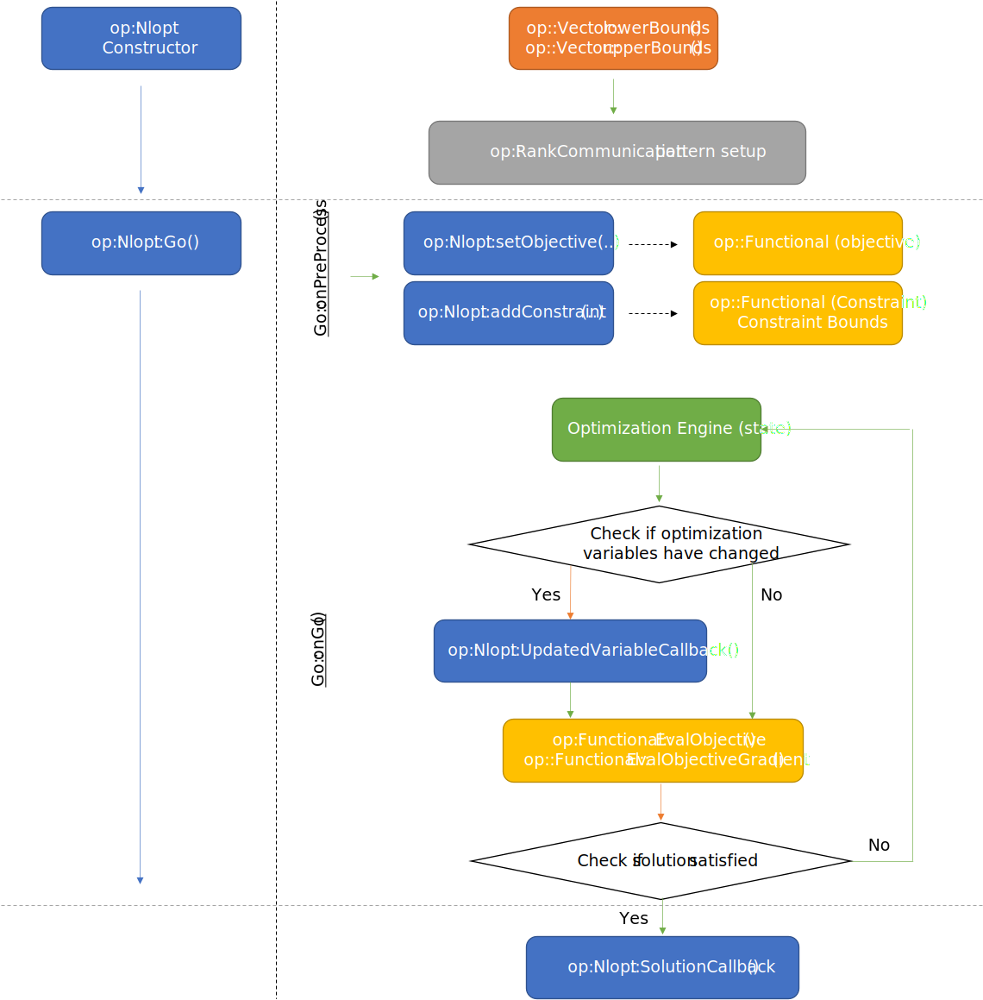
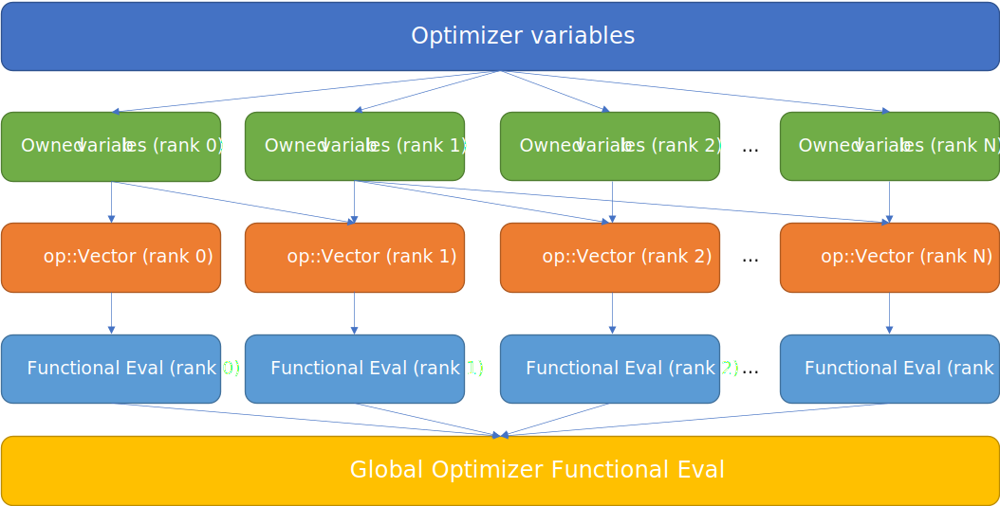
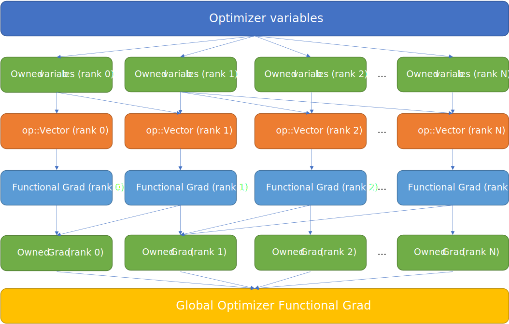
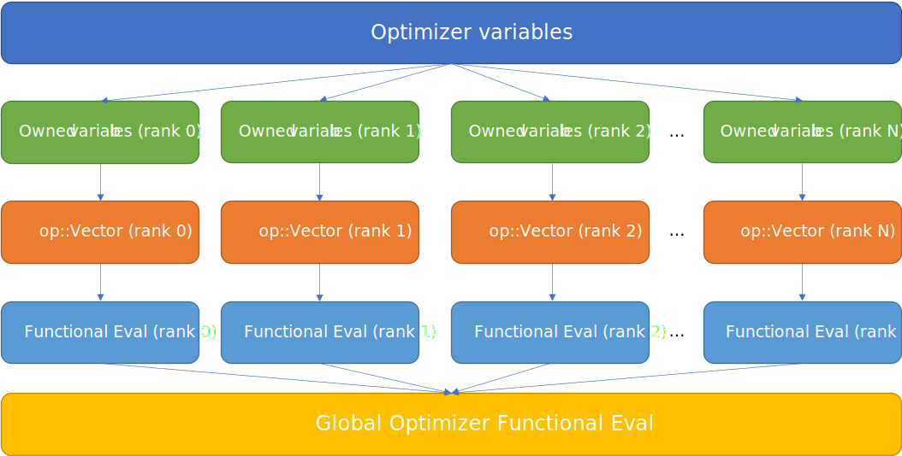
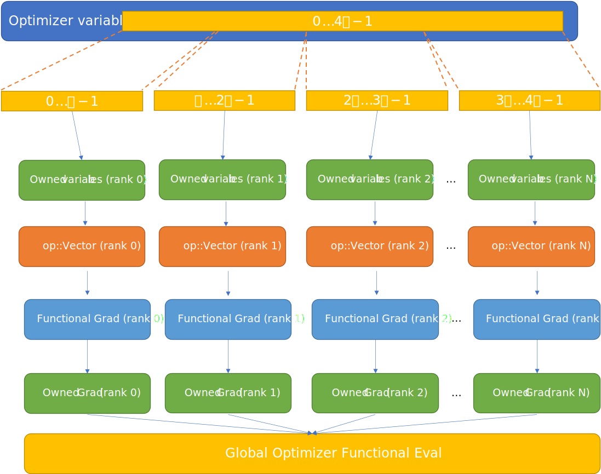
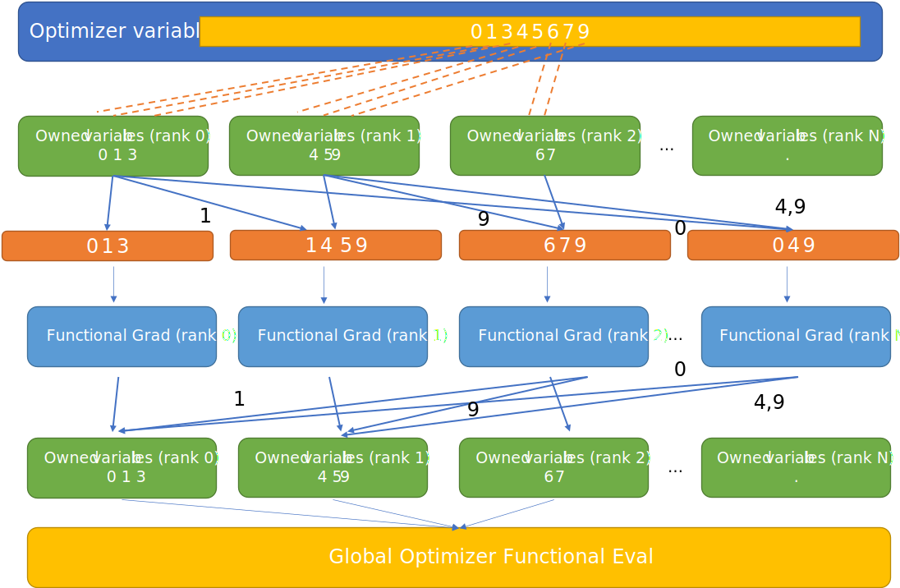
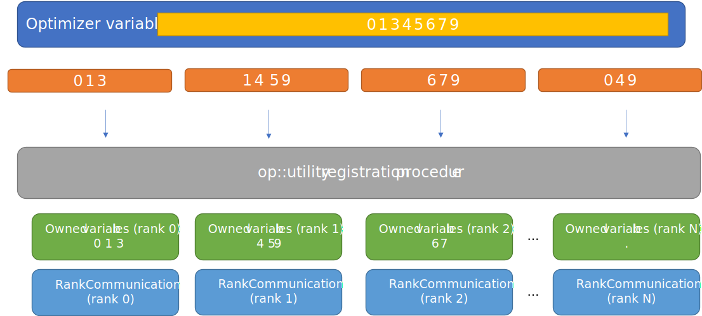
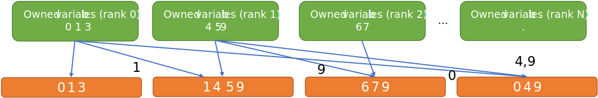
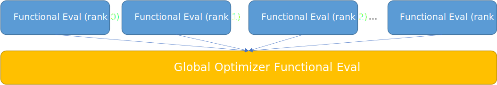
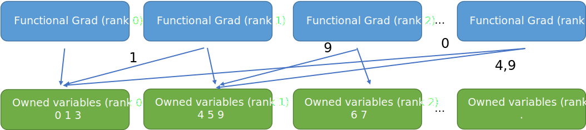

.. ## Copyright (c) 2021, Lawrence Livermore National Security, LLC and
.. ## other OP Project Developers. See the top-level COPYRIGHT file for details.
.. ##

===========================
Core Optimizer Abstractions
===========================

Overview of Optimizer Abstractions
----------------------------------

`op` provides several core optimizer abstractions to provide optimizer "interoperability" and facilitate transioning between different optimizers. These abstractions are lightweight wrappers over both data and optimization operations/functionals and do not "own" any data.

The following abstractions are used to define optimization problems:

* ``op::Vector``
* ``op::Functional``
* ``op::Optimizer``

To try to keep things consistent and ease transition between serial and parallel problems, the ``op`` interface is designed to work on rank-local views of each of the abstractions. The ``op`` api then provides a suite of convenience methods to generalize transfers whether the problem is serial or parallel based on the rank-local paradigm. Thus, in addition to the core optimizer abstractions, the `op` framework has a data flow model for parallel optimization problems that abstracts away many complications related to MPI data exchange for optimization problems. A `op::utility` and `op::mpi` namespace is also provided for convenience to simplify custom parallel implementation based on provided patterns.
   
  
``Vector``
------------------------------------

The ``Vector`` abstraction wraps an optimization variable vector. C++ functions to compute the lower and upper bounds of the data must be provided on construction.

``Functional``
------------------------------------
The ``Functional`` abstraction can be used to wrap the objective of an optimization problem or constraints. To construct a ``Functional``, one needs to provide a function that computes a `double` from optimization variables, and also the gradient of this function w.r.t. optimization variables. In addition, lower and upper bounds on the evaluation of the function can be provided.

Conversion wrappers for ``Functional``
**************************************

The following conversion wrappers are provided for specific optimizers.

+-----------+--------------------------+-------------------+
| Optimizer | to Optimizer-abstraction | to op-abstraction |
+-----------+--------------------------+-------------------+
| nlopt     | NLoptFunctional          | wrapNLoptFunc     |
+-----------+--------------------------+-------------------+

MPI-parallel ``Functional`` operation patterns
**********************************************

The following methods are provided to make it easier to compose ``Functional``s that in MPI parallel optimization problems.

* ``ReduceObjectiveFunction`` - Takes in a rank-local function evaluation and applies a `MPI_Op` over the specified communicator.
* ``OwnedLocalObjectiveGradientFunction`` - Computes gradient of "owned" variables over the specified communicator.

``Optimizer``
----------------------------------------
The purpose of the ``Optimizer`` abstraction is to generically wrap optimization solvers and provide a standardized interface. A series of callbacks is defined (stubbed) by default and different optimizers and users can customize the solver to fit their needs.

Every ``Optimizer`` has the following generic problem description interface:

* ``setObjective`` - which sets a Functional as the objective for the optimization problem
* ``addConstraint`` - which adds a new cosntraint Functional

Every ``Optimizer`` provides several callbacks to control optimization flow.

- ``Go()`` which calls the internal user-definable ``go`` function. By default, an implementation of this callback should start the optimization problem, and assume objectives, constraints, and other problem information is provided. Typically ``setObjective`` and ``addConstraint`` are called in a user-defined function. Calling ``Optimizer::Go()`` starts the optimization problem.
- ``UpdatedVariableCallback()`` which calls the internal user-definable ``update`` function. This is called whenver the optimizer implementation updates the design variables. In the case of topology optimization, one might compute forward and adjoint solves in the callback.
- ``Solution()`` returns the final global objective result.
- ``Iteration()`` is a callback cooresponding to the ``iterate`` user-definable function. This is called at every optimization iteration.
- ``SaveState()`` is a callback corresponding to the ``save`` user-definable function. This is used for saving the state of an optimization for possible restart.

The following control diagram illustrates how the different callbacks and methods in the `op` core abstractions interface might be called in an general optimization problem.

Optimization Control-flow Model
-------------------------------
Before we delve into the data-flow model which allows us to use serial optimizers with parallel simulation and design capabilities, the overall control flow model in ``op`` will be discussed. The control-flow diagram below uses ``op::NLopt`` as an example in how the different core abstractions and their callbacks interact.

The left-side of the figure illustrates user calls, while the right-side details the underlying callbacks and decisions being made amongst the different core abstractions.

	   

During construction of the optimizer, the size and `labelling` of  ``op::Vector`` is used to gather global problem information, determine the bounds of the optimization variables and also determine possible communication patterns between the MPI ranks.

Next the user-defined pre-process phase allows the user to add objectives and constraints and other optimization setup details.

Lastly, the final phase is where the underlying optimization solver starts optimizing the problem. Generally speaking, the optimizer can be treated as a "black box" where the optimizer tells our ``op``-Optimizer wrapper what state it's in. Using the ``op`` api, one can generalize the control flow for different data flow patterns relatively easily.

In the case of ``op::Nlopt`` it isn't clear that the optimization variales have been changed, so that is checked first. If the variables have changed, we update the variables on each rank and then the `UpdateVariableCallback()` is initiated on each rank.

Once the variables are up-to-date, we use ``op::Functional`` to compute the objectives and gradients. (Note: if the variables are up-to-date, it is guaranteed that `UpdatedVariableCallback()` has been called except in the initialization case for the optimizer) These results are then sent off to the optimizer. 

This process continuse in a loop until the optimization metrics have been satisified in finding a solution or there is an error. When the solution has been reached ``SolutionCallback()`` is initiated.

	   
Optimization Data-flow Model
----------------------------

The ``op`` framework assumes the following general data flow model. There is a concept of optimization variables being "owned" by a particular rank. Namely, these ranks are soley responsible for transfering and reducing data and interact with the optimizer. Ranks that do not "own" any variables still participate in evaluating functionals and functional gradients, but those ranks do not interact directly with optimizers.

While users are free to assign which ranks own which variables, ``op::utility`` provides methods for self-registration of "owned" variables. Each rank broadcasts an identifier (global id) for each variable corresponding to ``op::Vector``. The lowest rank which conatins this identifier is the "owner" of this variable. ``op::utility`` builds local mappings for all ranks according to a particular identifer set and ``op::utility::Rankcommunication`` struct is used to organize which variables must be sent to the owning rank, and also variables that will be sent to rank-owned variables.

The general data flow to calculate an particular optimization objective/constraint is shown below:

Above we first see the optimization variables representation coming from the ``op::Optimizer``. Each ``op::Optimizer`` should operate on "owned" variables. Currently the user is responsible for obtaining "owned" data; ``op::utility`` provides some methods of doing this for users. The data is then propagated (``op::utlity`` methods) back to ``op::Vector`` which is a rank-local view of optimization variables. The functional is evaluated in a rank-local manner. The functional is then reduced to the final global optimizer functional result. All ``op::Optimizers`` expect the  *final global functional result* (objective or constraint) to be returned when evaluating the functionals.
	   
The general data flow to calculate a particular optimization objective/constraint gradient is shown below:
	   

It's similar to the data flow for evaluating the optimzation functionals. The main difference is that local functional gradient evaluation contributions are first propagated back to "owned" ranks. The ranks which "own" those portions of the gradient then propagate the gradient back to the optimizer.

Simple Example
**************

A common data flow model for optimization problems run in parallel is where every rank has a unique set of optimization variables and ranks do not share contributions to a particular optimization variable. This is shown below:

In this case, every rank already "owns" their variables, in which case there is no difference between "owned" variables and rank-local views; they are the same.	
   
Take the following example. Given optimization variables indexed from `0-4p`, if this optimization is performed on 4 processors, the first `p`-optimization variables can be given to the first rank and so on.

Advanced Example
****************

To demonstrate the generality of the data flow model, we'll look at an advanced example. Here we have 8 optimization variables spread over 4 ranks. The first rank owns optimization variables labelled `0 1 3` and so on. The user is responsible (using ``op::utility`` methods) to propagate the optimization variables from "owned" variables per rank to rank-local views (orange). Then we evaluate the gradient on every rank. Lastly we reduce to "owned" ranks (using ``op::utility`` methods) and we return the "owned" portions of the gradient to the optimizer.

.. note::
   One should be careful to delineate differences between `index` and `label`. In ``op``, `index` refers to an offset within an array. On the other hand, `label` or `id` , is an identifier and need not be contigious or necessarily "bounded". In the "simple" data-flow model, the local optimization variables are implicitly labelled with a unique offset that corresponds to (rank, local_index) in a Column-sparse row storage format (CSR). This implicit labelling is consistent with other conventional configurations of optimization solvers (e.g. ``ipopt``).
   
   However, for the "Advanced" example, `labels` are used to "mark" relations between ranks. Therefore one may need not only maps to go to and from simulation quantities to `labels`, but also to and from `labels` to the actual rank-local optimization variable `index` values.

   

To generate the dashed orange lines, we might employ an initial registration procedure that will tell each rank what variables it "owns" as well as the inter-rank communicator mappings that define the blue arrow communication pattern to local variables.

	   
The following lines of code use ``op::utility`` methods to generate the pattern in this advanced example.
	   
::

  // dvs_on_rank is the map (orange).
  // rank 0 (dvs_on_rank[] = {0 ,1, 3})
  // rank 1 (dvs_on_rank[] = {1, 4, 5, 9})
   
  // gather global variable information
  auto [global_size, variables_per_rank] = op::utility::parallel::gatherVariablesPerRank<int>(dvs_on_rank.size());

  // Form labels and give to everyone
  // all_global_labels[] = {0,1,3,1,4,5,9,6,7,9,0,4,9}
  auto all_global_labels =
      op::utility::parallel::concatGlobalVector(global_size, variables_per_rank, dvs_on_rank);

  // create unordered map to use with generateSendRecievePerRank
  auto global_ids_to_local = op::utility::inverseMap(dvs_on_rank);

  // generate the rank-local RankCommunication data structure for dvs_on_rank-indexing on each rank in parallel
  auto recv_send_info =
      op::utility::parallel::generateSendRecievePerRank(global_ids_to_local, all_global_labels, offsets);

  // filter out entries that correspond to send to get our local variables that we own
  auto owned_dvs_on_rank = op::utility::filterOut(dvs_on_rank, recv_send_info.send);

Since this is an expected pattern, ``op`` provides an implementation of this for users to simplify the process (``op::AdvancedRegistration(...)``). Users supply the global id labeling of each optimization variable in `op::Vector`.

.. warning::
   It is important that the ordering of the variables be set before the call to ``op::AdvancedRegistration(...)``. The pattern above assumes that the labeling of the global ids corresponds to `op::Vector` and to the entries in the gradients of `op::Functional`s.
   

Example:

.. code-block:: c++

   /** Registration **/
   auto comm_pattern = op::AdvancedRegistration(global_ids_on_rank);

where ``CommPattern`` contains the following information.

.. code-block:: c++
		
   template <typename T>
     struct CommPattern {
     op::utility::RankCommunication<T> rank_communication;
     T                                 owned_variable_list;
     T                                 local_variable_list;
   };

   
After the initial registration procedure, we can go from "owned" local variables to local variable views using the following code.

::

   // owned_updated values should be provided by the optimizer
   auto updated_local_variables =
      op::ReturnLocalUpdatedVariables(recv_send_info, global_ids_to_local, owned_updated_values);

In ``op::NLopt`` this is performed automatically whenever the optimization variables change and before the call to ``UpdatedVariableCallback()`` so that the user's view can be consistently `rank-local`.
      
Convenience functions are available in ``op`` to help with global objective evaluations can.

::

   // When calculating the objective, every rank calculates it's local objective
   auto local_obj =  {
     double sum = 0;
     ...
     return sum;
   };

    // apply a reduction pattern to the local_objective function
   auto global_obj = op::ReduceObjectiveFunction<double, std::vector<double>>(local_obj, MPI_SUM);

Another convenience function is available to help evaluate a gradient locally and then reduce the gradient on ranks that own variables.
   

::

     // For the gradients things get more interesting
     // First compute the local_obj_gradient from this rank
     auto local_obj_grad =  {
        std::vector<double> grad(local_variables.size());
	...
	return grad;
     };

     // We want to determine the local gradient that corresponds to "owned" variables
     auto reduced_local_obj_grad =
     op::OwnedLocalObjectiveGradientFunction(recv_send_info, global_ids_to_local,
        local_obj_grad,
        op::utility::reductions::sumOfCollection<std::vector<double>>);

